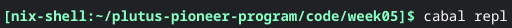
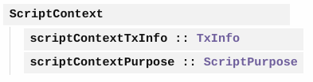
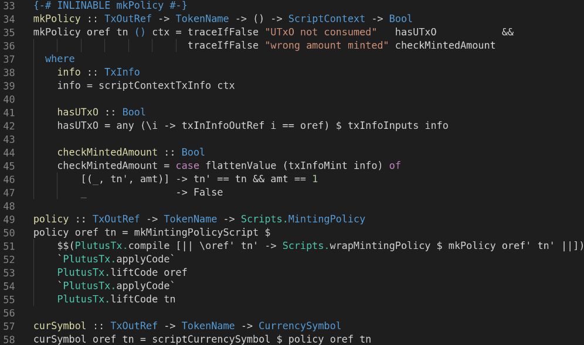

# Lecture #5 - Minting Tokens and NFTs

Contributed by: Joe Totes
## Table of Contents
- [Lecture #5 - Minting Tokens and NFTs](#lecture-5---minting-tokens-and-nfts)
	- [Table of Contents](#table-of-contents)
	- [Preparation for Lecture 5](#preparation-for-lecture-5)
	- [Values](#values)
	- [A Simple Minting Policy](#a-simple-minting-policy)
	- [A More Realistic Minting Policy](#a-more-realistic-minting-policy)
	- [NFT's](#nfts)
	- [Homework Part 1](#homework-part-1)
	- [Homework Part 2](#homework-part-2)
## Preparation for Lecture 5

Before we can get started in lecture 5, we first must get our development environment up to date. You can right click on any of the code snippet images and click alt text to copy and paste the code into the terminal.

First, head to the plutus-pioneer-program directory to grab the lecture week 5 contents. Execute:

You can now navigate to the current week05 directory and open the cabal.project file:

Grab the plutus-apps tag:

Head back to  to the plutus-apps directory and update it to the  current git tag:

You should now be up to date and can run nix-shell in this directory. Run nix-shell:

Head back to the week05 folder to start running the cabal commands:

If successful,  you should now be ready to start the lecture:

## Values

We first looked at a new constructor Value:

Each native token, including ADA, is represented by a currency symbol and token name. Where currency symbol is:

Token name is:

Asset Class is

ADA will be one asset class. Custom native tokens will be other asset classes.

Starting with the repl, we can first import Plutus.V1.Ledger.Value and Plutus.V1.Ledger.Ada:

Then, we can set -XOverloadedStrings:

We first look at adaSymbol, adaToken, and lovelaceValueof:

Example:

Combining Values:

Then we learned how to use the function singleton that allows us to create values with native tokens:

Example:

Combining Values:

We can then take the value of the result using:

Example, where x is the input from the above entry:

We can then flatten the map using the flattenValue function:

Example:

## A Simple Minting Policy

Before we look at a simple minting script, we can review the relevant script context.

We can now load the Free.hs minting script.

You can now run curSymbol to get the hash of the script:

Looking at the off chain code:

Then finally, the Emulator Trace:

We can now run the test emulator trace:

Note how both wallets have the same hash associated with “ABC”.

## A More Realistic Minting Policy

Instead of having an unparameterized minting policy, we will change it to a parametrized one. This will instead allow an owner from a specific public key hash to mint, rather than anyone.

Where txSignedBy and scriptContextTxInfo are:

And the modified off chain code to account for the PaymentPubKeyHash:

Load the new Signed.hs file into the repl:

Run the test emulator Trace:

The Results:

The wallet’s now have different hashes associated with “ABC”.

## NFT's

Non Fungible Tokens are tokens which only exist once. Previous examples were not NFTs because we were able to mint as many tokens as possible.

Since the Mary era, it was possible to implement pseudo NFTs based using deadlines to lock down the minting process. This requires checking with a blockchain explorer whether or not one was minted before the deadline. These are not true NFTs since they require secondary checks.

Since the plutus era, we can construct true NFTs that are only minted once, without the need to validate from a blockchain explorer. The trick is to use a unique ID that cannot be duplicated; and in this case for Cardano, it is the UtxOs that only exist once. UtxOs are never reused.

## Homework Part 1

The goal of homework 1 is to write a Mary era contract that uses deadlines and signature checks to mint a specific token ABC.

We first need to implement the mkPolicy that takes the PaymentPubKeyHash, POSIXTime and ScriptContext to produce a Boolean to check both cases in which the beneficiary has signed the transaction; as well as checking that the deadline has not passed.

I created && logic that checks both the signature in the checkSig function and the deadline in the checkDeadline function. This will only return true if both are true. In checkDeadline, we also want to use “to” making sure we are in the valid range.

We then need to create the policy that takes both PaymentPubKeyHash and POSIXTime as pkh and deadline respectively.

Finally, we need to get the hash for curSymbol taking in both PaymentPubKeyHash and POSIXTime.

The final Code looks like:

The final output running the test trace looks like:

## Homework Part 2

The goal of homework part 2 is to mint an NFT for a given UTxO where the TokenName is a ByteString.

First we need to write the mkPolicy in which checks if the UTxO is consumed, and also if the correct amount was minted.

The "hasUTx0" function is a boolean that checks the TxOutRef to report true or false.

The checkMintedAmount will check to make sure only 1 is actually minted. We also pass _ into the token argument since we are working with an empty argument.

Next we will implement the policy and curSymbol functions. Each of these will only accept the oref since we are not working with the token names.

Finally, we need to implement the mint function. The mint function passes only the address here. Since the TokenName is a bytestring, we also need to declare it as:

We also only need to pass 2 arguments into the singleton function:

The mint function should then look like:

The final code should then look like:

The resulting output is:

